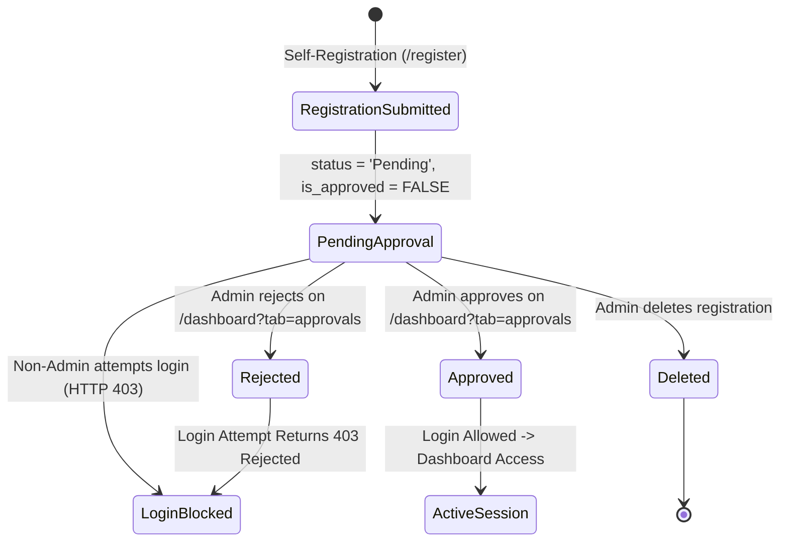

# 🛡️ Role-Based Access Control (RBAC) Specification & Summary — Medicare HMS

> **Medicare Hospital Management System**  
> Comprehensive documentation of the authentication, authorization, role lifecycle, and permissions matrix implemented across the full stack (Node.js/Express, PostgreSQL/Supabase, and React).

---

## 📑 Table of Contents
1. [Overview & Architecture](#1-overview--architecture)
2. [User Roles in the System](#2-user-roles-in-the-system)
3. [Registration & Approval Lifecycle](#3-registration--approval-lifecycle)
4. [Backend Security & Middleware Architecture](#4-backend-security--middleware-architecture)
5. [Complete Permissions & Endpoint Matrix](#5-complete-permissions--endpoint-matrix)
6. [Frontend UI/UX Role-Based Enforcement](#6-frontend-uiux-role-based-enforcement)
7. [Database Schema & Data Model](#7-database-schema--data-model)
8. [Session Management & Security Controls](#8-session-management--security-controls)

---

## 1. Overview & Architecture

Medicare HMS enforces a multi-tiered **Role-Based Access Control (RBAC)** architecture combining:
- **Dual-Provider JWT Authentication:** Primary authentication handled through Supabase Auth (OAuth / GoTrue) with a backward-compatible fallback to custom signed JWTs.
- **Admin Gatekeeper Approval Flow:** Self-registration is open for staff roles, but newly created accounts are placed in a `Pending` state with `is_approved = FALSE`. They cannot access protected resources or log in until vetted and approved by an Administrator.
- **Backend Middleware Authorization:** Granular route-level role authorization via Express middleware (`protect` and `authorize(...roles)`).
- **Frontend Context & UI Adaptation:** React `AuthContext`, route guards (`ProtectedRoute`), dynamic navigation tabs, role badges, and administrator management controls.

```
       +-------------------------------------------------------------+
       |                     Client Application                      |
       |  (React 18 + Vite + Tailwind CSS + AuthContext + Sidebar)    |
       +------------------------------+------------------------------+
                                      |
                      HTTP Request with Bearer Token
                                      |
                                      v
       +-------------------------------------------------------------+
       |                   Backend API (Express.js)                  |
       +-------------------------------------------------------------+
                                      |
                     [ 1. protect Middleware ]
                     - Validates Supabase JWT / Local JWT
                     - Resolves user profile from database
                     - Enforces Approval Check:
                       (Non-Admin accounts must be Approved)
                                      |
                     [ 2. authorize(...roles) ]
                     - Compares user's role against allowed list
                     - Returns 403 Forbidden if not permitted
                                      |
                                      v
       +-------------------------------------------------------------+
       |             Controllers & PostgreSQL / Supabase             |
       +-------------------------------------------------------------+
```

---

## 2. User Roles in the System

The application defines **8 functional hospital roles**:

| Role Name | Identifier (Normalized) | Typical Hospital Personnel | Core Domain Responsibility |
|---|---|---|---|
| **Administrator** | `admin` | IT Admin, Medical Director, Superuser | Full system administration, user approval/rejection, doctor profiles, audit logs, and record deletion. Cannot be self-registered. |
| **Doctor** | `doctor` | Physicians, Specialists, Surgeons | Patient care, appointments, diagnosis & EMR (prescriptions, vitals), lab test requests, inpatient admissions, attendance & staff leave approvals. |
| **Nurse** | `nurse` | Head Nurses, Ward Nurses, Clinic Staff | Inpatient admissions & ward transfers, patient intake & updates, invoice payments/billing updates, attendance tracking. |
| **Receptionist** | `receptionist` | Front Desk, Admissions Clerk | Patient registration, scheduling appointments, bill creation, recording staff attendance, processing leave status. |
| **Laboratory Staff** | `lab` | Lab Technicians, Pathologists | Laboratory test creation, entering test results/ranges, uploading test reports and documents. |
| **Pharmacist** | `pharmacist` | Chief Pharmacist, Dispensing Staff | Pharmacy inventory CRUD (stock, batches, expiry), dispensing medicines, dispensing prescribed EMR medications, recording billing payments. |
| **Accountant / Cashier**| `accountant`, `cashier` | Billing Officers, Hospital Cashiers | Invoice creation, recording payments (Cash, Card, Insurance), receipt generation. |
| **Human Resources** | `hr` | HR Coordinator, Administrative Staff | Staff employee directory management, salary/leave records, staff attendance management. |

---

## 3. Registration & Approval Lifecycle

To prevent unauthorized access to sensitive Protected Health Information (PHI) and medical records, Medicare implements a mandatory **Admin Approval Workflow**:



### Key Security Safeguards:
1. **Self-Registration Restrictions:**
   - Public registration allows selecting: `Doctor`, `Nurse`, `Receptionist`, `Lab Staff`, `Pharmacist`, or `Accountant`.
   - **`Admin` is strictly blocked from self-registration** at both client select dropdown and backend controller validation (`req.body.role.toLowerCase() === "admin"` triggers `400 Bad Request`).
2. **Approval Enforcement in Middleware:**
   - In `backend/middleware/authMiddleware.js`, every incoming authenticated request verifies:
     ```javascript
     const userRole = (u.role || "").toLowerCase();
     const isApproved = u.is_approved !== false && u.status !== "Pending" && u.status !== "Rejected";
     if (userRole !== "admin" && !isApproved) {
       return res.status(403).json({
         message: "Your registration is pending administrator approval...",
         isPendingApproval: true,
       });
     }
     ```
   - Administrators bypass this check, ensuring system maintainability.

---

## 4. Backend Security & Middleware Architecture

Role-based authorization is enforced on the server through two primary middlewares located in `backend/middleware/authMiddleware.js`:

### 1. `protect` Middleware
- Inspects `req.headers.authorization` for `Bearer <token>`.
- Validates the token against Supabase Auth (`supabase.auth.getUser(token)`) or fallback JWT secret (`jwt.verify(token, JWT_SECRET)`).
- Queries the PostgreSQL `users` table to retrieve live role and approval status.
- Attaches normalized user data to `req.user`:
  ```javascript
  req.user = {
    _id: u.id,
    id: u.id,
    auth_id: authUser.id,
    name: u.name,
    email: u.email,
    role: u.role,          // e.g., 'Admin', 'Doctor', 'Nurse'
    status: u.status,      // 'Approved', 'Pending', 'Rejected'
    isApproved: u.is_approved
  };
  ```

### 2. `authorize(...roles)` Middleware
- High-order middleware wrapping route handlers.
- Performs case-insensitive comparison of `req.user.role` against permitted roles:
  ```javascript
  const authorize = (...roles) => {
    return (req, res, next) => {
      const userRole = (req.user?.role || "").toLowerCase();
      const allowed = roles.map((r) => r.toLowerCase());
      if (!allowed.includes(userRole)) {
        return res.status(403).json({
          message: `Role '${req.user?.role}' is not authorized for this action`
        });
      }
      next();
    };
  };
  ```

---

## 5. Complete Permissions & Endpoint Matrix

The following table details every route in the Medicare backend, the HTTP methods supported, the roles allowed, and the security rules applied:

| Module | Method | Endpoint | Authorized Roles | Description / Operation |
|---|---|---|---|---|
| **Auth** | `POST` | `/api/auth/register` | **Public** *(Admin role blocked)* | Register new hospital staff account (`status: Pending`) |
| **Auth** | `POST` | `/api/auth/login` | **Public** *(Requires approval)* | Authenticate user; rejects pending/unapproved accounts |
| **Auth** | `GET` | `/api/auth/me`, `/profile` | **All Authenticated** | Fetch logged-in user profile & role |
| **Auth** | `PUT` | `/api/auth/change-password`| **All Authenticated** | Change password with current password verification |
| **Approvals** | `GET` | `/api/auth/registrations` | `admin` | Fetch all user registrations with status filter |
| **Approvals** | `PUT` | `/api/auth/registrations/:id/approve` | `admin` | Approve pending user account |
| **Approvals** | `PUT` | `/api/auth/registrations/:id/reject` | `admin` | Reject user registration request |
| **Approvals** | `DELETE` | `/api/auth/registrations/:id` | `admin` | Delete user registration from database |
| **Audit Logs** | `GET` | `/api/audit-logs` | `admin` | Inspect system-wide security audit logs |
| **Audit Logs** | `POST` | `/api/audit-logs` | **All Authenticated** | Create audit trail log entry |
| **Dashboard** | `GET` | `/api/dashboard/stats` | **All Authenticated** | Fetch dashboard KPI summary statistics |
| **Reports** | `GET` | `/api/reports/*` | **All Authenticated** | Access reports (Summary, Patients, Appointments, Revenue, Pharmacy, Lab, Staff) |
| **Doctors** | `GET` | `/api/doctors`, `/:id` | **All Authenticated** | View active doctor profiles, schedules, specializations |
| **Doctors** | `POST` | `/api/doctors` | `admin` | Add new doctor profile |
| **Doctors** | `PUT` | `/api/doctors/:id` | `admin` | Edit doctor information and availability |
| **Doctors** | `DELETE` | `/api/doctors/:id` | `admin` | Remove doctor profile |
| **Patients** | `GET` | `/api/patients`, `/:id` | **All Authenticated** | View patient registry and details |
| **Patients** | `POST` | `/api/patients` | `admin`, `doctor`, `nurse`, `receptionist` | Register new patient |
| **Patients** | `PUT` | `/api/patients/:id` | `admin`, `doctor`, `nurse`, `receptionist` | Update patient records & demographics |
| **Patients** | `DELETE` | `/api/patients/:id` | `admin` | Permanently delete patient record |
| **Appointments** | `GET` | `/api/appointments`, `/:id`| **All Authenticated** | List appointments and calendar bookings |
| **Appointments** | `POST` | `/api/appointments` | `admin`, `doctor`, `receptionist` | Book/schedule patient appointment |
| **Appointments** | `PUT` | `/api/appointments/:id` | `admin`, `doctor`, `receptionist` | Reschedule, confirm, complete, or cancel appointment |
| **Appointments** | `DELETE` | `/api/appointments/:id` | `admin` | Delete appointment record |
| **EMR / Records**| `GET` | `/api/medical-records`, `/:id` | **All Authenticated** | View clinical consultation records & diagnoses |
| **EMR / Records**| `POST` | `/api/medical-records` | `admin`, `doctor` | Create medical record with diagnosis, vitals & prescriptions |
| **EMR / Records**| `PUT` | `/api/medical-records/:id` | `admin`, `doctor` | Update clinical diagnosis & treatment plan |
| **EMR / Records**| `DELETE` | `/api/medical-records/:id` | `admin` | Delete medical record |
| **Laboratory** | `GET` | `/api/laboratory`, `/:id` | **All Authenticated** | View lab requests, tests, and pending analyses |
| **Laboratory** | `POST` | `/api/laboratory` | `admin`, `doctor`, `lab` | Order/create new laboratory test |
| **Laboratory** | `PUT` | `/api/laboratory/:id` | `admin`, `doctor`, `lab` | Record test results, normal ranges & technician notes |
| **Laboratory** | `DELETE` | `/api/laboratory/:id` | `admin` | Delete laboratory test order |
| **Pharmacy** | `GET` | `/api/pharmacy`, `/:id` | **All Authenticated** | View medication inventory, batches, and stock levels |
| **Pharmacy** | `GET` | `/api/pharmacy/prescriptions`| **All Authenticated** | Fetch pending prescriptions requiring dispensing |
| **Pharmacy** | `POST` | `/api/pharmacy` | `admin`, `pharmacist` | Add medicine to inventory |
| **Pharmacy** | `PUT` | `/api/pharmacy/:id` | `admin`, `pharmacist` | Update medicine stock, batch details, unit price |
| **Pharmacy** | `DELETE` | `/api/pharmacy/:id` | `admin`, `pharmacist` | Delete medicine entry |
| **Pharmacy** | `POST` | `/api/pharmacy/:id/dispense`| `admin`, `pharmacist`, `doctor` | Dispense medicine directly and deduct stock |
| **Pharmacy** | `POST` | `/api/pharmacy/prescriptions/:recordId/dispense` | `admin`, `pharmacist`, `doctor` | Dispense prescribed medications directly from EMR record |
| **Admissions** | `GET` | `/api/admissions`, `/:id` | **All Authenticated** | View inpatient admissions, rooms, and bed occupancy |
| **Admissions** | `POST` | `/api/admissions` | `admin`, `doctor`, `nurse` | Admit patient to room/bed |
| **Admissions** | `PUT` | `/api/admissions/:id` | `admin`, `doctor`, `nurse` | Update admission status, room transfer, or discharge patient |
| **Admissions** | `DELETE` | `/api/admissions/:id` | `admin` | Delete admission record |
| **Staff & HR** | `GET` | `/api/staff`, `/:id` | **All Authenticated** | View hospital staff directory |
| **Staff & HR** | `POST` | `/api/staff` | `admin`, `hr` | Create staff profile |
| **Staff & HR** | `PUT` | `/api/staff/:id` | `admin`, `hr` | Edit staff profile and department |
| **Staff & HR** | `DELETE` | `/api/staff/:id` | `admin` | Delete staff profile |
| **Staff & HR** | `POST` | `/api/staff/:id/attendance` | `admin`, `hr`, `receptionist`, `staff`, `doctor`, `nurse` | Record attendance (Present, Late, Absent, Half Day) |
| **Staff & HR** | `POST` | `/api/staff/:id/leave` | **All Authenticated** | Submit employee leave request |
| **Staff & HR** | `PUT` | `/api/staff/:id/leave/:leaveId` | `admin`, `hr`, `receptionist`, `doctor` | Approve or reject staff leave request |
| **Staff & HR** | `DELETE` | `/api/staff/:id/leave/:leaveId` | `admin`, `hr` | Delete leave record |
| **Billing** | `GET` | `/api/billing`, `/:id` | **All Authenticated** | View invoices, payment statuses, and receipts |
| **Billing** | `POST` | `/api/billing` | `admin`, `accountant`, `receptionist` | Generate invoice with billable line items |
| **Billing** | `PUT` | `/api/billing/:id` | `admin`, `accountant`, `receptionist`, `cashier`, `doctor`, `nurse`, `pharmacist` | Record payments (Partial / Paid) and update payment status |
| **Billing** | `DELETE` | `/api/billing/:id` | `admin` | Delete billing invoice |
| **Uploads** | `POST` | `/api/uploads/single`, `/multiple` | **All Authenticated** | Upload medical documents, scans, and attachments |
| **Uploads** | `DELETE` | `/api/uploads` | **All Authenticated** | Delete uploaded attachment from Supabase Storage |

---

## 6. Frontend UI/UX Role-Based Enforcement

The frontend React application (`frontend/src`) uses `useAuth()` and the centralized RBAC utility (`frontend/src/utils/rbac.js`) to enforce access boundaries and adapt presentation:

### 1. Role-to-Module Navigation Matrix
The navigation sidebar dynamically filters visible tabs based on the logged-in user's role:

| Module / Tab | Route | Permitted Roles | Hidden / Removed From |
|---|---|---|---|
| **Dashboard** | `/dashboard` | `admin` | **All non-admin roles** (Doctor, Nurse, Receptionist, Pharmacist, Lab, Accountant, HR) |
| **User Approvals** | `/dashboard?tab=approvals` | `admin` | All non-admin roles |
| **Security Audit Logs** | `/audit-logs` | `admin` | All non-admin roles |
| **Patients** | `/patients` | `admin`, `doctor`, `nurse`, `receptionist`, `accountant`, `cashier`, `hr` | `pharmacist`, `lab` |
| **Doctors Directory** | `/doctors` | `admin`, `doctor`, `nurse`, `receptionist`, `accountant`, `cashier`, `hr` | `pharmacist`, `lab` |
| **Appointments** | `/appointments` | `admin`, `doctor`, `nurse`, `receptionist` | `pharmacist`, `lab`, `accountant`, `cashier`, `hr` |
| **Medical Records (EMR)** | `/emr` | `admin`, `doctor`, `nurse` | `receptionist`, `pharmacist`, `lab`, `accountant`, `cashier`, `hr` |
| **Laboratory** | `/laboratory` | `admin`, `doctor`, `lab` | `nurse`, `receptionist`, `pharmacist`, `accountant`, `cashier`, `hr` |
| **Pharmacy** | `/pharmacy` | `admin`, `doctor`, `pharmacist` | `nurse`, `receptionist`, `lab`, `accountant`, `cashier`, `hr` |
| **Inpatient Admissions** | `/admissions` | `admin`, `doctor`, `nurse`, `receptionist` | `pharmacist`, `lab`, `accountant`, `cashier`, `hr` |
| **Staff Management** | `/staff` | `admin`, `hr` | `doctor`, `nurse`, `receptionist`, `pharmacist`, `lab`, `accountant`, `cashier` |
| **Billing & Receipts** | `/billing` | `admin`, `accountant`, `receptionist`, `cashier` | `doctor`, `nurse`, `pharmacist`, `lab`, `hr` |
| **Reports & Analytics** | `/reports` | `admin`, `accountant`, `cashier`, `hr` | `doctor`, `nurse`, `receptionist`, `pharmacist`, `lab` |

### 2. Role Landing & Post-Login Redirection (`getDefaultRouteForRole`)
Since the central Dashboard is reserved exclusively for Administrators, each role is automatically routed to their primary workflow module upon signing in or whenever redirected:
- **`admin`** $\rightarrow$ `/dashboard`
- **`doctor`** $\rightarrow$ `/appointments`
- **`nurse`** $\rightarrow$ `/patients`
- **`receptionist`** $\rightarrow$ `/appointments`
- **`pharmacist`** $\rightarrow$ `/pharmacy`
- **`lab`** $\rightarrow$ `/laboratory`
- **`accountant` / `cashier`** $\rightarrow$ `/billing`
- **`hr`** $\rightarrow$ `/staff`

### 3. Route Protection Guard (`App.jsx`)
All internal application routes are protected by `<ProtectedRoute path="...">`:
- If an unauthenticated user attempts access, they are redirected to `/login`.
- If an authenticated user enters a URL for a module not permitted for their role (e.g., a receptionist manually visiting `/audit-logs` or `/dashboard`), `ProtectedRoute` checks `isRouteAllowed(path, user.role)` and instantly redirects them to their designated landing page via `getDefaultRouteForRole(user.role)`.

### 4. Role Badges & Visual Theming
Standardized color-coded badges highlight user authority across the UI (Navbar, Dashboard, Audit Logs):
- **Admin:** `bg-red-50 text-red-700 border-red-200`
- **Doctor:** `bg-blue-50 text-blue-700 border-blue-200`
- **Nurse:** `bg-teal-50 text-teal-700 border-teal-200`
- **Receptionist:** `bg-purple-50 text-purple-700 border-purple-200`
- **Laboratory:** `bg-emerald-50 text-emerald-700 border-emerald-200`
- **Pharmacist:** `bg-amber-50 text-amber-700 border-amber-200`
- **Accountant:** `bg-rose-50 text-rose-700 border-rose-200`
- **HR:** `bg-teal-50 text-teal-700 border-teal-200`

---

## 7. Database Schema & Data Model

The PostgreSQL `users` table establishes the foundation for RBAC:

```sql
CREATE TABLE IF NOT EXISTS users (
  id SERIAL PRIMARY KEY,
  auth_id UUID,                     -- Foreign UUID linking to Supabase auth.users
  name VARCHAR(255) NOT NULL,
  email VARCHAR(255) NOT NULL UNIQUE,
  password VARCHAR(255) NOT NULL,    -- Bcrypt hashed password
  role VARCHAR(50) DEFAULT 'Receptionist', -- Staff role
  status VARCHAR(20) DEFAULT 'Pending',   -- 'Pending', 'Approved', 'Rejected'
  is_approved BOOLEAN DEFAULT FALSE,      -- Approval gatekeeper flag
  created_at TIMESTAMP DEFAULT CURRENT_TIMESTAMP,
  updated_at TIMESTAMP DEFAULT CURRENT_TIMESTAMP
);
```

Related tables maintain foreign key references or user attribution:
- `doctors.user_id REFERENCES users(id)`: Links a doctor staff user to their clinical profile and schedule.
- `audit_logs.user_name` & `audit_logs.role`: Records who performed every auditable system action.
- `staff.leaves`: JSON array tracking `appliedBy` and `reviewedBy` user names.

---

## 8. Session Management & Security Controls

1. **Inactivity Auto-Logout (`SESSION_TIMEOUT_MS`):**
   - Implemented in `frontend/src/context/AuthContext.jsx`.
   - Automatically tracks user mouse movement, clicks, and keypresses.
   - Triggers an in-app notification warning at **25 minutes** of inactivity.
   - Automatically terminates the session and signs out at **30 minutes** of total inactivity.
2. **Password Security:**
   - Hashed using `bcryptjs` with salt rounds = 10.
   - Password changes require verifying current password before writing updates to both local PostgreSQL and Supabase Auth tables.
3. **Audit Trail:**
   - Significant administrative and clinical events (system migration, user approvals, record changes) are logged to the `audit_logs` table for compliance with healthcare data regulations.
